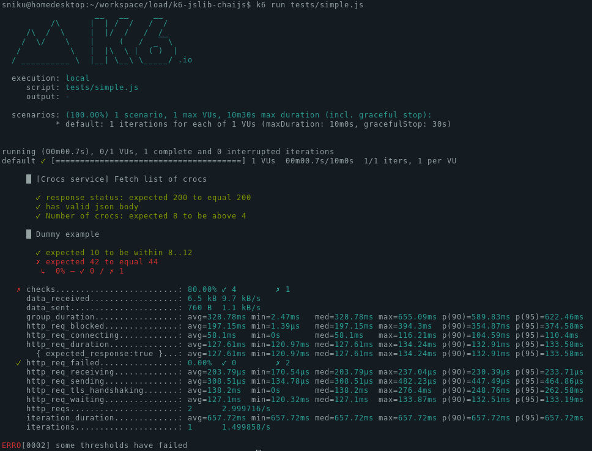

# k6Chaijs - ChaiJS Assertion Library for k6.io

This is a [chaijs](https://www.chaijs.com/) library with a few modifications to make it runnable in k6.

Installation docs: https://www.chaijs.com/api/bdd/

API docs: http://k6.io/docs/javascript-api/jslib/chaijs

Download from: https://jslib.k6.io/

## Example

```js
import http from 'k6/http';
import { describe, expect } from 'https://jslib.k6.io/k6chaijs/4.3.4.0/index.js';

export let options = {
  thresholds: {
    checks: [{ threshold: 'rate == 1.00', abortOnFail: true }],
    http_req_failed: [{ threshold: 'rate == 0.00', abortOnFail: true }],
  },
};

export default function testSuite() {

  describe('[Crocs service] Fetch list of crocs', () => {
    let response = http.get('https://test-api.k6.io/public/crocodiles');

    expect(response.status, "response status").to.equal(200)
    expect(response).to.have.validJsonBody()
    expect(response.json().length, "Number of crocs").to.be.above(4)
  })

  describe('Dummy example', () => {
    expect(10).to.be.within(8,12); // OK
    expect(42).to.equal(44); // fails
    expect(true).to.be.ok; // doesn't run because the previous assertion failed.
  });

}

```




## Development 


#### Build
```
npm install
npm run-script webpack
```

#### Deploy new version
1. Build.
2. Use the `./build/k6chaijs.min.js` to make a PR to [jslib.k6.io](https://github.com/grafana/jslib.k6.io). 
3. Release version should follow the chaijs version. Currently `4.3.4.0`.